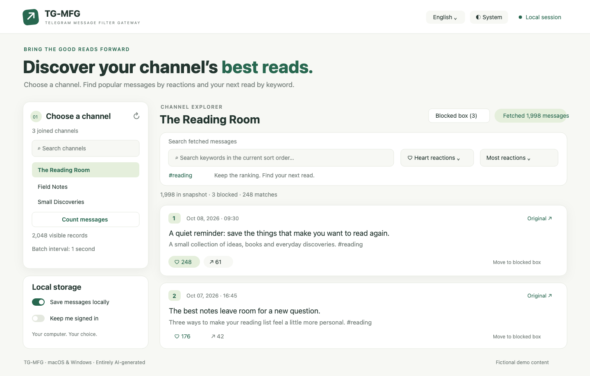

# TG-MFG — Telegram Message Filter Gateway

**English** | [简体中文](README.zh-CN.md)

> [!IMPORTANT]
> **Only macOS and Windows clients are supported. All other client platforms are unsupported, including Linux, Android and iOS / iPadOS.**

> [!WARNING]
> **ALL CODE IN THIS PROJECT WAS ENTIRELY GENERATED BY AI**, including the frontend, backend, installation and launch helpers, build scripts and tests. It has not received an independent security audit.

Browse your Telegram channels locally, rank messages by ❤️ or other reactions, and search the messages you have fetched. English is the default interface language; switch to Simplified Chinese in the header. **Error messages are always English.** Python core, vanilla JavaScript, no CDN and no frontend build step.



*Illustrative UI with fictional channels and messages.*

## Features

- List your joined broadcast channels, including archived channels.
- Count visible channel messages with one history request, without downloading the full history.
- Rank by total reactions, a selected reaction or message date. Combine keyword search and Telegram `#hashtag` filters without changing the sort order.
- Move messages to a **blocked box** to exclude them from the normal list, search and hashtag filters; restore individually.
- Fetch a chosen range or all readable history, with inclusive local-time date filters and cancellation that keeps partial results.
- Choose a minimum batch interval of **0.5, 1, 2, 5, 10 or 30 seconds** (default: 1). Adjust it during fetching.
- See records read, displayable messages, observed skip reasons and why fetching ended.
- Optionally save message snapshots and blocked records locally for offline search after restarting.
- Check existing message IDs for text, reaction and availability changes, retaining previous text and unconfirmed snapshots.
- Optionally retain login using **macOS Keychain** or **Windows current-user DPAPI**.
- System, light and dark themes; persistent English / Simplified Chinese preference.
- SOCKS5 / HTTP CONNECT proxies, proxy tunnel tests and opt-in redacted diagnostics.
- Run locally, or use a private website that distributes and launches each visitor’s own local core.

## Run from source

Requires **Python 3.9+**. Prefer a Python version still receiving security updates. Node.js 22+ is needed only for JavaScript tests.

macOS:

```sh
sh run.sh
```

Windows:

```bat
run.bat
```

The first run creates `.venv` and installs pinned dependencies from official PyPI with SHA-256 verification. Open **http://127.0.0.1:8765**, enter your own [Telegram API ID and API Hash](https://my.telegram.org/apps), and sign in. These are user API credentials, not a Bot Token. Login codes may arrive in the official Telegram app; a two-step password is required if enabled.

Choose a channel, optionally count its messages, then select the fetch range and speed. Telethon requests **up to 100 records per batch**, sometimes fewer. A 2,000-record range is fetched across multiple batches. The interval is a minimum delay between batch requests, not a per-message delay or a guaranteed throughput. Network time also affects speed. Changes apply to later batches without interrupting the current wait. A Telegram FloodWait stops fetching and keeps partial results.

Search and sorting use fetched snapshots only. Search does not make extra Telegram requests. Media captions are searchable; media files, comments and OCR are not fetched. Paid Stars are excluded from ordinary reaction totals.

If you need a proxy, enable it **before connecting**, enter the actual protocol, host and port, and use **Connection diagnostics → Test proxy settings**. Only proxies without username/password authentication are supported. Failure stops the connection; it never falls back to direct access.

If the default port is occupied, use `sh run.sh --port 8767` or `run.bat --port 8767`. Closing the browser does not stop the core. Ctrl+C exits source mode.

## Fetch reports, local storage and update checks

A fetch limit counts records, including channel service records. Reading 2,000 records while displaying 1,998 messages is therefore possible. The report distinguishes observed service records, records outside the date range, unsupported records and duplicates, and explains reaching the limit, history/date boundary, cancellation or errors. **Records Telegram never returns cannot be explained; gaps in message IDs do not prove a loss in this fetch.**

Two independent switches are **off by default**:

- **Save messages locally:** save the latest snapshot for each account/channel, partial results and blocked records. Enabling it also saves the current list. Open a saved channel for offline search, even without signing in. Disabling it deletes all accounts’ disk snapshots; the current in-memory list remains usable.
- **Keep me signed in:** save Telegram authorization, API ID / Hash and proxy settings after login, protected by the OS. Phone numbers, login codes and two-step passwords are not saved. macOS uses the login Keychain; Windows uses current-user DPAPI, with no plaintext fallback. If secure storage is unavailable, saving fails visibly. Network failures retain authorization for retry; invalid or revoked authorization requires signing in again. Restoration uses the saved proxy without falling back to direct access.

Data directories:

- macOS: `~/Library/Application Support/TG-MFG/data`
- Windows: `%LOCALAPPDATA%\TG-MFG\data`

**Message snapshots in `messages.sqlite3` are not encrypted.** Programs with access to your user files may read them. Windows `login.bin` contains DPAPI ciphertext; macOS authorization is stored in Keychain. `preferences.json` contains switches and account IDs. Upgrades preserve this data directory.

**Stop core** preserves opted-in data. **Disconnect & clear** attempts Telegram logout and deletes saved login, all message snapshots and blocked records. Turning off login retention deletes the saved authorization without logging out the active session. Deleting files is not secure erasure and does not clear backups. If logout cannot be confirmed, remove the session in the official Telegram app under **Devices**.

**Check fetched messages for updates** requires a signed-in account with channel access. It requests existing IDs in batches of up to 100 at the selected interval. Changes to text/hashtags, reactions and other fields are counted separately. Previous text remains available; current text is searched and current reactions are ranked. Explicit empty/service records mark a message unavailable and exclude it from normal search while retaining its snapshot. Missing IDs, errors, lost access and cancellation retain old content without assuming deletion. Blocked state is preserved.

Update checks do not append new messages or subscribe to automatic updates. Fetch again to obtain newer messages; that replaces the channel’s latest snapshot and does not prove messages outside the range were deleted. Accounts remain isolated. A blocked box spans channels in the active account and ignores the normal list’s keyword/hashtag filters.

## Website and installers

The website serves only the interface and Mac / Windows downloads. Telegram connections run on **each visitor’s computer**; the browser talks directly to `127.0.0.1:8765`. The website server does not handle Telegram login or messages.

Download and fully extract the package from the website. On Windows, run `install.bat`; on Mac, run `install.command`. The installer registers the fixed `tg-mfg://start` launcher. Next time, click **Start core** on the website. Browsers may require a click or confirmation; a webpage cannot silently install software.

The Windows x64 package includes official Python and pinned dependencies. The Mac package requires Python 3.9+ and downloads dependencies on first installation. This source repository contains neither the compiled Mac launcher nor the Windows runtime. **Linux, mobile clients, 32-bit Windows and native Windows ARM64 packages are not provided.** Linux containers may host the static website; this does not imply Linux client support.

- [Windows guide](README-Windows.md)
- [Website container deployment](DEPLOYMENT.md)
- [Build installers](docs/BUILD.md)
- [Security boundaries and reporting](SECURITY.md)
- [Changelog](CHANGELOG.md)

## Security boundaries

By default credentials, sessions and messages stay in core memory. Opted-in storage remains on the local computer. Browser localStorage contains only language/theme preferences and a non-secret installation marker, never Telegram credentials or messages. Debug logging is off by default; enabled logs contain bounded, redacted route/timing/error metadata and proxy host/port, not request bodies, credentials or message content.

The core listens on loopback only and validates Host, Origin and a random API token. Downloaded packages allow the explicitly configured website origin, with no wildcard CORS. CSP is enforced and message text is rendered with `textContent`.

**The configured website and its scripts are part of the trust boundary:** that origin can obtain the core token and call its APIs. Protect its code, downloads and HTTPS. Local programs, browser extensions and users with local access are outside this isolation boundary. Telegram user authorization has account permissions; Telegram does not issue a read-only token for this project. The code uses only the required login, logout and reading APIs.

Bulk reading remains subject to Telegram limits and account rules. No message count guarantees immunity from restrictions. See [SECURITY.md](SECURITY.md).

## Development

```sh
python -m venv .venv
# On Windows use .venv\Scripts\python.exe instead.
.venv/bin/python -m pip install --require-hashes -r requirements.txt
.venv/bin/python -m unittest discover -s tests -p 'test_*.py' -v
node --test tests/test_*.mjs
```

Tests use fake Telegram clients and loopback proxies, without real accounts or Telegram access. GitHub Actions covers Python 3.9 / 3.13 on macOS, Windows and an additional Linux test environment; Linux is not a supported client. Remote workflow results are available only after upload.

Offline tests do not replace native Windows installer, launcher and DPAPI checks. The Mac launcher is ad-hoc signed, not notarized. Pinned hashes and passing tests are not an independent security audit.

## Source layout

```text
app.py / storage.py / network_proxy.py / diagnostics.py   Local core
launcher.py / install_core.py / launcher-mac.swift        Install and launch
portal.py / Dockerfile / compose.yaml                     Static website
web/                                                     UI, search, themes, languages
scripts/                                                 Portable package builders
tests/                                                   Offline Python / JavaScript tests
docs/ / LICENSES/                                         Guides, artwork and licenses
```

## License

[MIT](LICENSE). Dependencies retain their own licenses; see [third-party notices](THIRD_PARTY_NOTICES.md). TG-MFG is not an official Telegram product.
